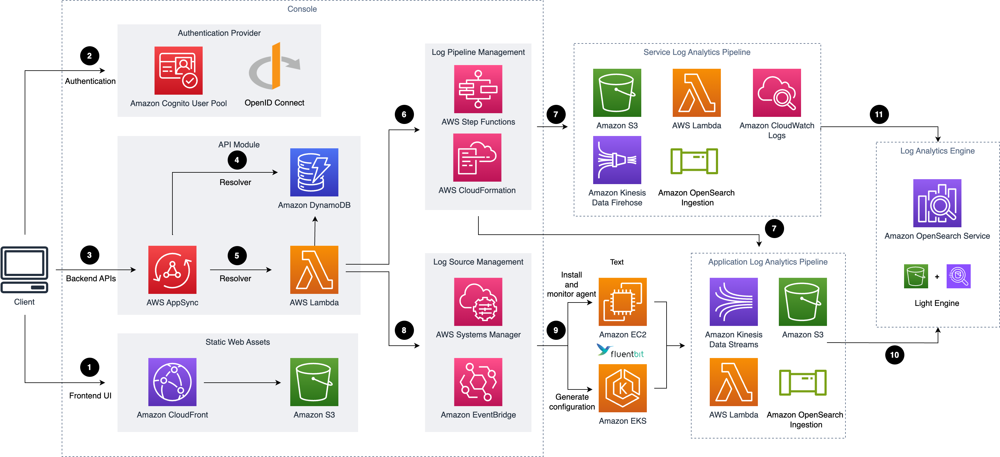

# Centralized Logging with OpenSearch

The Centralized Logging with OpenSearch solution provides comprehensive log management and analysis functions to help you simplify the build of log analytics pipelines. Built on top of <strong><a href="https://aws.amazon.com/opensearch-service/">Amazon OpenSearch Service</a></strong>, the solution allows you to streamline log ingestion, log processing, and log visualization. You can leverage the solution in multiple use cases, such as to abide by security and compliance regulations, achieve refined business operations, and enhance IT troubleshooting and maintenance.

## Table of content

- [Centralized Logging with OpenSearch](#centralized-logging-with-opensearch)
  - [Table of content](#table-of-content)
  - [Solution Overview](#solution-overview)
  - [Architecture](#architecture)
  - [Deployment](#deployment)
  - [Customization](#customization)
  - [Collection of operational metrics](#collection-of-operational-metrics)

## Solution Overview

The solution has the following features:

- **All-in-one log ingestion**: provides a single web console to ingest both application logs and AWS service logs into the Amazon OpenSearch (AOS) domains.

- **Codeless log processor**: supports log processor plugins developed by AWS. You are allowed to enrich the raw log data through a few clicks on the web console.

- **Out-of-box dashboard template**: offers a collection of reference designs of visualization templates, for both commonly used software such as Nginx and Apache HTTP Server, and AWS services such as Amazon S3 and Amazon CloudTrail.

## Architecture

Deploying this solution with the default parameters builds the following environment in the AWS Cloud.

## Deployment

Please follow the [Implementation Guide](https://docs.aws.amazon.com/solutions/latest/centralized-logging-with-opensearch/) to deploy the solution in your AWS account.

## Customization

Please follow the [Customization Guide](CUSTOM_BUILD.md) for custom build.

