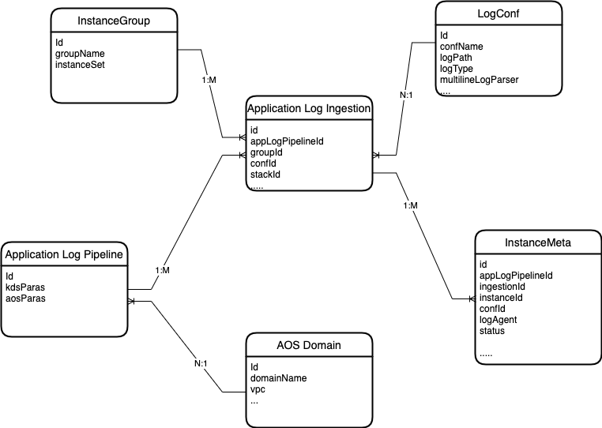

# Service Log Pipeline Data Model Design

## Overview

This part uses Amazon DynamoDB as the backend NoSQL database. This document is about the Data Model Design for **Application Log Pipeline** module. To learn more information about the module, refer to [Architecture Design](../architecture-design)

### Entity Relationship Diagram

#### LogConf Table

LogConf table stores information about the Application log configuration information by this solution, such as log type, log path.

The data attributes are listed as below:

| Attribute name     | Type   | Description                                 | Comments                    |
| ------------------ | ------ | ------------------------------------------- | --------------------------- |
| id                 | String | Unique ID of a configuration                | Partition key               |
| confName           | String | The name of the configuration name          |                             |
| createdDt          | String | creation time                               |                             |
| logPath            | String | Log file path                               |                             |
| logType            | String | Json, Regex, Nginx, Apache, MultiLineText   |                             |
| multilineLogParser | String | JAVA_SPRING_BOOT                            |                             |
| regularExpression  | String | Regular expressions                         |                             |
| regularSpec        | String | Field type definition after regular parsing |                             |
| status             | String | ACTIVE, INACTIVE                            | INACTIVE means delete state |
| userLogFormat      | String | Log format                                  |                             |
| updatedDt          | String | The last time the data was updated          |                             |

#### InstanceGroup Table

InstanceGroup table stores information about the instance and grouping relationship information by this solution, such as log type.

The data attributes are listed as below:

| Attribute name | Type   | Description                                                                                         | Comments                    |
| -------------- | ------ | --------------------------------------------------------------------------------------------------- | --------------------------- |
| id             | String | Unique ID of a group                                                                                | Partition key               |
| groupName      | String | The name of the log group. the name must be unique, and can only contains lower case letters and -. |                             |
| createdDt      | String | Creation time                                                                                       |                             |
| instanceSet    | String | List of instance ids                                                                                |                             |
| status         | String | ACTIVE, INACTIVE                                                                                    | INACTIVE means delete state |
| updatedDt      | String | The last time the data was updated                                                                  |                             |

#### InstanceMeta Table

InstanceMeta table stores information about the instance information by this solution.

The data attributes are listed as below:

| Attribute name       | Type   | Description                                  | Comments      |
| -------------------- | ------ | -------------------------------------------- | ------------- |
| id                   | String | Unique ID of a configuration                 | Partition key |
| createdDt            | String | Creation time                                |               |
| intanceId            | String | The EC2 instance id                          |               |
| appPipelineId String |        | The Partition key of the AppPipeline table   |               |
| logAgent             | Map    | sub-field: agentName: FluentBit              |               |
|                      |        | sub-field: version: 1.8.2                    |               |
| confId               | String | The Partition key of the LogConf table       |               |
| groupId              | String | The Partition key of the InstanceGroup table |               |
| status               | String | ACTIVE, INACTIVE                             |               |
| updatedDt            | String | The last time the data was updated           |               |

#### LogAgentStatus Table

LogAgentStatus table stores information about the status of Fluent Bit installation information by this solution.

The data attributes are listed as below:

| Attribute name | Type   | Description                        | Comments      |
| -------------- | ------ | ---------------------------------- | ------------- |
| intanceId      | String | the EC2 instance Id                | Partition key |
| createdDt      | String | creation time                      |               |
| id             | String | the Command Id                     |               |
| status         | String | Not_Installed, Online, Offline     |               |
| updatedDt      | String | The last time the data was updated |               |

#### AppPipeline Table

AppPipeline table stores information about Application Log Pipeline information by this solution.

The data attributes are listed as below:

| Attribute name | Type   | Description                                                                      | Comments      |
| -------------- | ------ | -------------------------------------------------------------------------------- | ------------- |
| id             | String | Unique ID of a pipeline                                                          | Partition key |
| createdDt      | String | creation time                                                                    |               |
| aosParas       | Map    | the Command Id                                                                   |               |
|                |        | sub-field: opensearchArn, type: String                                           |               |
|                |        | sub-field: domainName, type: String                                              |               |
|                |        | sub-field: indexPrefix, type: String                                             |               |
|                |        | sub-field: warmLogTransition, type: Number                                       |               |
|                |        | sub-field: coldLogTransition, type: Number                                       |               |
|                |        | sub-field: logRetention, type: Number                                            |               |
| kdsParas       | Map    | sub-field: kdsArn, type: String                                                  |               |
|                |        | sub-field: streamName, type:String                                               |               |
|                |        | sub-field: enableAutoScaling, type:Boolean, True, False; In UI, we use yes or no |               |
|                |        | sub-field: startShardNumber, type:Number                                         |               |
|                |        | sub-field: maxShardNumber, type:Number                                           |               |
|                |        | sub-field: regionName, type:String                                               |               |
|                |        | sub-field:engine, type:String                                                    |               |
| tags           | Map    | sub-field: key-value, type:String                                                |               |
| status         | String | CREATING, DELETING, ERROR, INACTIVE, ACTIVE                                      |               |
| updatedDt      | String | The last time the data was updated                                               |               |

#### AppLogIngestion Table

AppLogIngestion table stores information about Application Log Ingestion information by this solution.

The data attributes are listed as below:

| Attribute name | Type   | Description                                                                                                                                                                          | Comments      |
| -------------- | ------ | ------------------------------------------------------------------------------------------------------------------------------------------------------------------------------------ | ------------- |
| id             | String | Unique ID of a pipeline                                                                                                                                                              | Partition key |
| createdDt      | String | creation time                                                                                                                                                                        |               |
| confId         | String | The Partition key of the LogConf table                                                                                                                                               |               |
| sourceType     | String | EC2,EKS, S3                                                                                                                                                                          |               |
| sourceId       | String | If EC2: then sourceId is groupId; If EKS: then sourceId is EKSClusterId; If S3: then sourceId is S3LogSourceInfo;                                                                    |               |
| groupId        | String | The Partition key of the InstanceGroup table                                                                                                                                         |               |
| stackId        | String | In the process of creating an application log pipeline, KDS and Lambda are created through the cloudformation stack. This item can be obtained through the listAppLogIngestions API. |               |
| stackName      | String | In the process of creating an application log pipeline, KDS and Lambda are created through the cloudformation stack. This item can be obtained                                       |
| appPipelineId  | String | The Partition key of the AppPipeline table                                                                                                                                           |               |
| tags           | Map    | Sub-field: key-value, type:String                                                                                                                                                    |               |
| status         | String | CREATING, DELETING, ERROR, INACTIVE, ACTIVE                                                                                                                                          |               |
| updatedDt      | String | The last time the data was updated                                                                                                                                                   |               |
