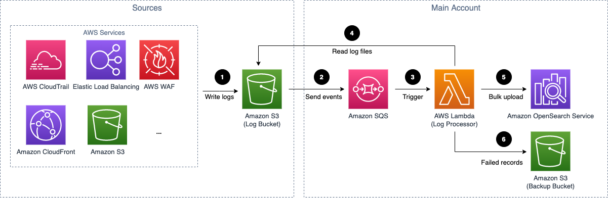
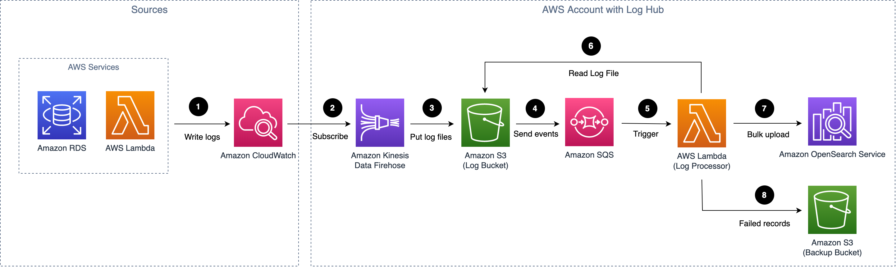

## Overall Architecture

Below is the high level architecture diagram for Global regions:

And this is the high level architecture diagram for China regions:

This solution deploys the following infrastructure in your AWS Cloud account:

1. [Amazon CloudFront](https://aws.amazon.com/cloudfront) to distribute the frontend web UI assets hosted in [Amazon S3](https://aws.amazon.com/s3/) bucket.

1. [AWS AppSync](https://aws.amazon.com/appsync) to provide the backend GraphQL APIs.

1. [Amazon Cognito user pool](https://aws.amazon.com/cognito) to provide authentication and authorization for frontend and backend.

1. [Amazon DynamoDB](https://aws.amazon.com/dynamodb) as backend database to store the solution related information.

1. [AWS Lambda](https://aws.amazon.com/lambda) to interact with other AWS Services to execute core logic including managing log pipelines or managing log agents and get the information updated in DynamoDB tables.

1. [AWS Step Functions](https://aws.amazon.com/step-functions) to orchestrate on-demand [AWS CloudFormation](https://aws.amazon.com/cloudformation) deployment of a set of predefined stacks for log pipeline management. The log pipeline stacks deploys separate AWS resources and are used to collect and process logs and ingest them into [Amazon OpenSearch Service](https://aws.amazon.com/opensearch-service) for further analysis and visualiztion.

1. [AWS Systems Manager](https://aws.amazon.com/systems-manager) and [Amazon EventBridge](https://aws.amazon.com/eventbridge) to manage log agent for collecting logs from Application Servers, such as installing log agents (fluentbit) to Application servers and monitoring the health status of the agents.

This solution supports two types of log pipeline, they are **Service Log Analytics Pipeline** and **Application Log Analytics Pipeline**.

## Service Log Analytics Pipeline

Log Hub supports log analysis for AWS services, such as Amazon S3 access logs, and Application Load Balancer access logs. For a complete list of supported AWS services, refer to [Supported AWS Services](./considerations.md).

AWS services output logs to different destinations, including Amazon S3 bucket, CloudWatch log groups, Kinesis Data Streams, and Kinesis Firehose. The solution ingests those logs using different workflows.

### Logs in Amazon S3

Some services use Amazon S3 as the destination, and the logs in Amazon S3 are generally not for real-time analysis. 

Figure 2: Amazon S3 service log pipeline architecture

The log pipeline runs the following workflow:

1. AWS services store logs in Amazon S3 bucket (Log Bucket).

2. A notification is sent to Amazon SQS when a new log file is created.

3. Amazon SQS triggers the Lambda (Log Processor) to run.

4. The log processor reads and processes the log file and ingests the logs into AOS.

5. The logs failed to be processed are exported to Amazon S3 bucket (Backup Bucket).

### Logs in Amazon CloudWatch

Some services use Amazon CloudWatch log group as the destination. 

Figure 3: Amazon CloudWatch service log pipeline architecture

The log pipeline runs the following workflow:

1. AWS Services store logs in Amazon CloudWatch log group.

2. The CloudWatch logs is streaming to Amazon Kinesis Data Stream (KDS) via subscription.

3. KDS triggers the Lambda (Log Processor) to run.

4. The log processor reads and processes the log records and ingests the logs into AOS.

5. The logs failed to be processed are exported to Amazon S3 bucket (Backup Bucket).

## Application Log Analytics Pipeline

Log Hub supports log analysis for application logs, such as Nginx/Apache HTTP Server logs or custom application logs. 

Figure 4: Application log pipeline architecture

The log pipeline runs the following workflow:

1. [Fluent Bit](https://fluentbit.io/) works as the underlying log agent to collect logs from application servers and send them to KDS.

2. KDS triggers the Lambda (Log Processor) to run.

3. The log processor reads and processes the log records and ingests the logs into AOS.

4. The logs failed to be processed are exported to Amazon S3 bucket (Backup Bucket).

[s3log]: https://docs.aws.amazon.com/AmazonS3/latest/userguide/ServerLogs.html
[alblog]: https://docs.aws.amazon.com/elasticloadbalancing/latest/application/load-balancer-access-logs.html
[s3]: https://aws.amazon.com/s3/
[cloudfront]: https://aws.amazon.com/cloudfront/
[cognito]: https://aws.amazon.com/cognito/
[appsync]: https://aws.amazon.com/appsync/
[lambda]: https://aws.amazon.com/lambda/
[dynamodb]: https://aws.amazon.com/dynamodb/
[systemsmanager]: https://aws.amazon.com/systemmanager/
[stepfunction]: https://aws.amazon.com/stepfunctions/
